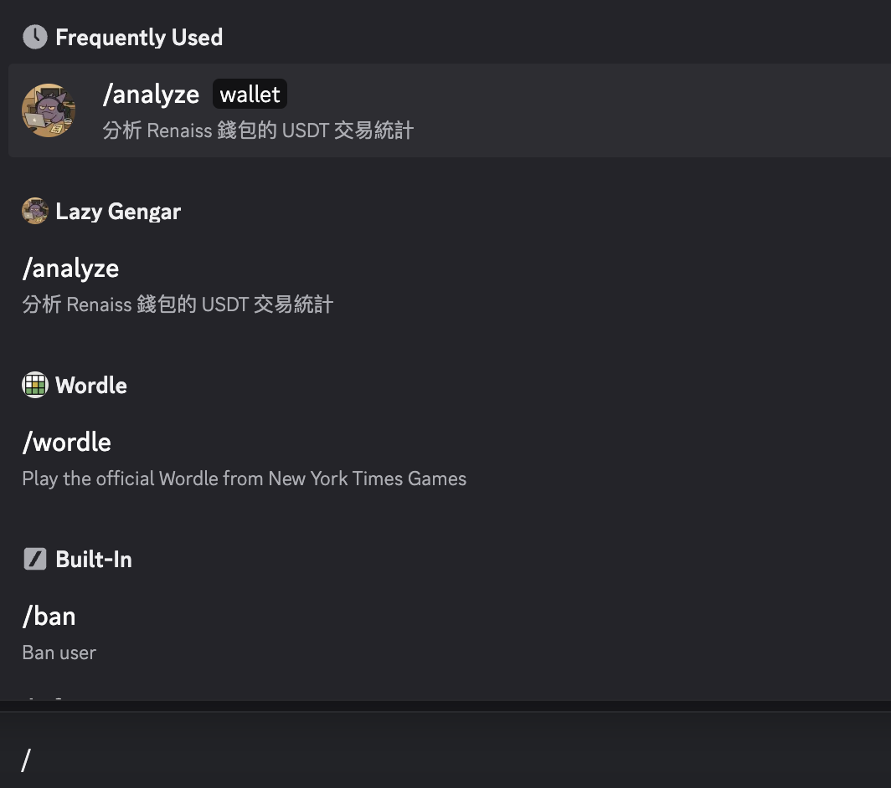
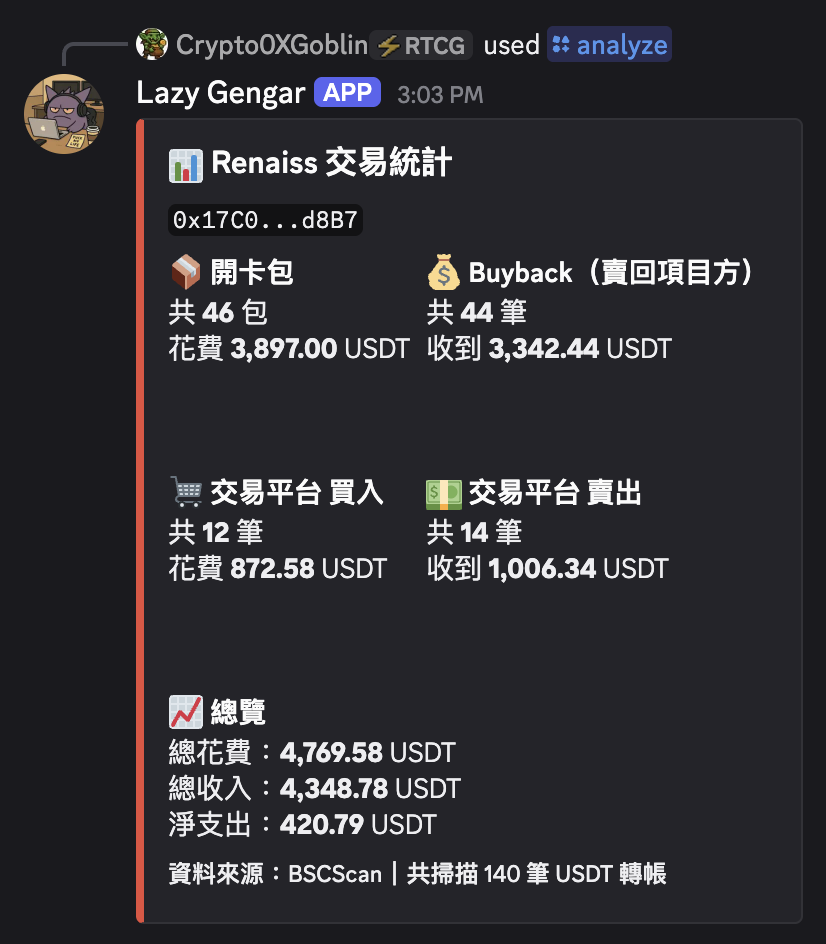
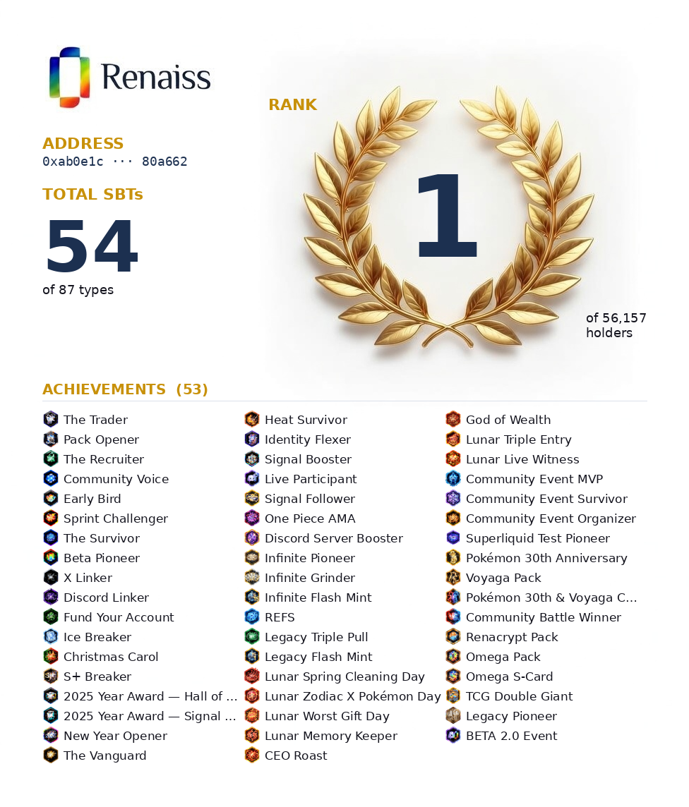

# Renaiss Transaction Analyzer

分析指定 BSC 錢包在 Renaiss 項目的所有 USDT 交易統計，支援 CLI 執行與 Discord Bot。

## 功能

- 開卡包次數與花費 USDT
- Buyback 賣回項目方收到的 USDT
- 交易平台買入 / 賣出的 USDT

## 環境需求

- Python 3.10+
- BSCScan API Key（免費申請：https://bscscan.com/myapikey）
- Discord Bot Token（若使用 Bot 功能）

## 安裝

```bash
pip install -r requirements.txt
```

## 設定

複製 `.env.example` 並改名為 `.env`，填入你的 API Key：

```bash
cp .env.example .env
```

```env
BSCSCAN_API_KEY=your_bscscan_api_key_here
DISCORD_TOKEN=your_discord_bot_token_here  # 只有使用 Bot 才需要
```

## 使用方式

### CLI 直接執行

在 `.env` 加入要查詢的錢包地址：

```env
WALLET=0xYourWalletAddressHere
```

```bash
python analyze_all.py
```

### Discord Bot

**步驟一：建立 Bot**

1. 前往 https://discord.com/developers/applications → New Application
2. 左側 Bot → Reset Token → 複製 token 填入 `.env`
3. 左側 OAuth2 → URL Generator
   - Scopes：`bot` + `applications.commands`
   - Bot Permissions：`Send Messages` + `Embed Links`
4. 複製產生的 URL，在瀏覽器開啟，將 Bot 加入你的伺服器

**步驟二：啟動 Bot**

```bash
python bot.py
```

看到 `Bot 已上線` 後，在 Discord 頻道使用指令：

**步驟一：輸入 `/` 叫出指令提示，選擇 `/analyze`**



**步驟二：輸入你的 BSC 錢包地址後送出，Bot 會公開回覆統計結果**



## 新增卡包合約

若項目方推出新版卡包合約，在 `analyze_all.py` 的 `PACK_CONTRACTS` 加入新地址：

```python
PACK_CONTRACTS = {addr.lower() for addr in {
    "0xaab5f5fa75437a6e9e7004c12c9c56cda4b4885a",
    "0x94e7732b0b2e7c51ffd0d56580067d9c2e2b7910",
    "0xb2891022648c5fad3721c42c05d8d283d4d53080",
    "0x新合約地址",  # 新增這裡
}}
```

---

# Renaiss SBT Ranking Bot

查詢 Renaiss 平台所有會員的 SBT（靈魂綁定代幣）持有量，並透過 Discord Bot 生成個人排名卡片。

## SBT 功能

- **自動同步鏈上數據**：每十分鐘從 BSCScan 抓取最新 ERC-1155 轉帳記錄，增量更新持有量
- **自動發現新 SBT**：每次更新時解析 renaiss.xyz JS bundle，自動載入新增的 SBT 類型（名稱、圖片）
- **排名卡片生成**：根據排名顯示不同底圖（金/銀/銅/黑），卡片包含地址、總 SBT 數、排名、所有成就
- **Discord 斜線指令**：`/sbt_rank` 輸入錢包地址即可查詢

## 展示



> Rank 1 持有者，擁有 52 個 SBT

底圖規則：
| 排名 | 底圖 |
|------|------|
| Top 10 | 金色 |
| Top 50 | 銀色 |
| Top 100 | 銅色 |
| 其他 | 黑色 |

## SBT Bot 使用方式

### 啟動 Bot

```bash
python bot.py
```

Bot 啟動後會：
1. 立即執行一次資料更新（同步鏈上數據 + 解析新 SBT）
2. 之後每十分鐘自動更新一次

### Discord 指令

在 Discord 頻道輸入：

```
/sbt_rank address:0xYourWalletAddress
```

Bot 會回傳該地址的個人排名卡片圖片。

若地址不在資料庫中（尚未更新或未持有任何 SBT），會提示等待下次更新。

### CLI 手動操作

```bash
# 立即抓取最新鏈上數據並更新 DB
python nft_top_holders.py

# 手動生成指定地址的卡片
python generate_card.py 0xYourWalletAddress
```

## 資料存儲

所有資料存於 `nft_data.db`（SQLite）：

| Table | 說明 |
|-------|------|
| `holdings` | 每個地址持有的每種 SBT 數量 |
| `rankings` | 地址排名與總 SBT 數 |
| `sbt_metadata` | SBT 類型、名稱、圖片檔名（自動更新）|
| `state` | 最後同步的區塊高度與持有量快照 |